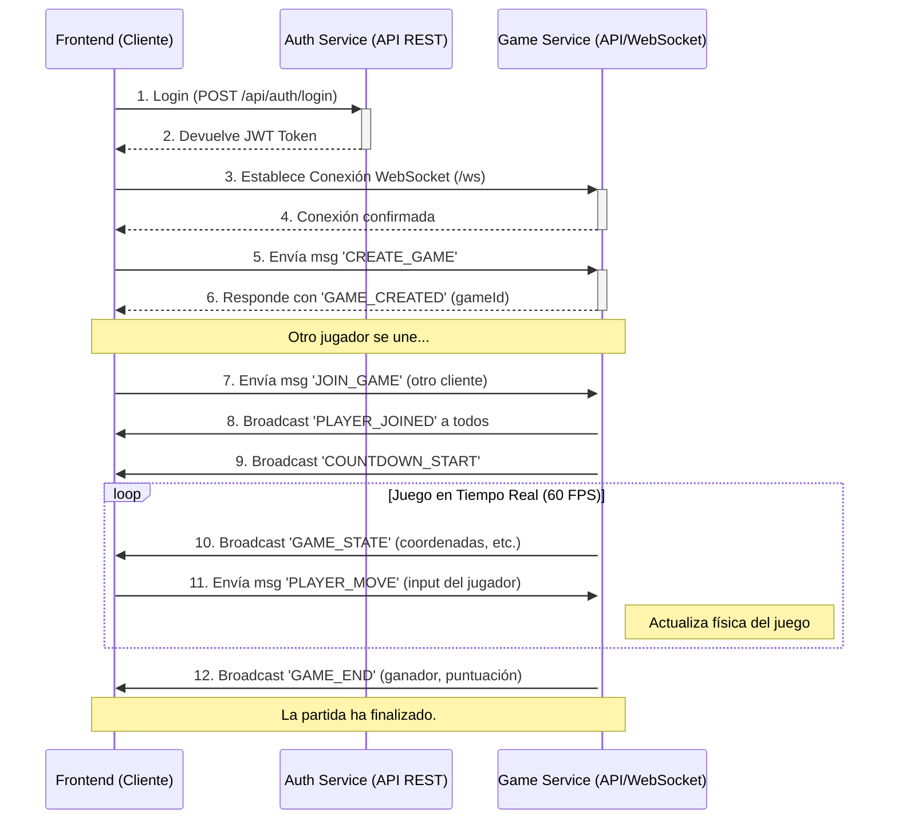

# Documentación del Flujo Completo del Juego: Frontend y Backend

## 1. Introducción Arquitectónica

Este documento describe el flujo de datos y la secuencia de eventos completos para una partida de Pong en la aplicación Transcendence. La arquitectura se compone de dos sistemas principales que se comunican de manera orquestada:

-   **Frontend (Cliente)**: Una Single Page Application (SPA) construida con TypeScript. Es responsable de la renderización de la interfaz, la captura del input del usuario y la visualización del estado del juego recibido desde el backend. **No ejecuta ninguna lógica de física del juego**.
-   **Game Service (Backend)**: Un microservicio de Node.js con Fastify y WebSockets. Es la **fuente autoritativa** de la verdad para toda la lógica del juego. Gestiona el estado de las partidas, la física, el matchmaking y la comunicación en tiempo real.

La comunicación entre estos dos sistemas se realiza a través de dos canales distintos, cada uno optimizado para un propósito específico:

-   **API REST (HTTP/S)**: Para acciones síncronas y sin estado, como la autenticación, la obtención de listas de partidas o la consulta de perfiles de usuario.
-   **WebSockets**: Para comunicación bidireccional, de baja latencia y en tiempo real, esencial para el gameplay (movimientos de jugadores, actualizaciones de estado, etc.).

---

## 2. El Flujo Completo de una Partida Online

A continuación, se detalla el ciclo de vida completo de una partida, desde que el usuario inicia sesión hasta que termina el juego.

### Diagrama de Secuencia de Alto Nivel

### Fase 1: Inicialización y Autenticación (Canal: API REST)

El objetivo de esta fase es verificar la identidad del usuario y preparar la aplicación para su uso.

1.  **Inicio en el Frontend**: El usuario abre la aplicación. El `main.ts` del frontend se ejecuta, inicializa el enrutador y la internacionalización.
2.  **Navegación a Login**: El enrutador redirige al usuario a la página de `/login`.
3.  **Petición de Login**: El usuario introduce sus credenciales y pulsa "Iniciar Sesión". El frontend empaqueta estos datos y realiza una petición `POST` a la API REST del **Auth Service**.
    -   `POST /api/auth/login` con `body: { email, password }`
4.  **Validación en Backend**: El Auth Service valida las credenciales contra la base de datos. Si son correctas, genera un **JSON Web Token (JWT)** que contiene la información del usuario (ID, username) y una fecha de expiración.
5.  **Recepción del Token**: El frontend recibe el JWT en la respuesta.
6.  **Almacenamiento Local**: El token se guarda de forma segura en `localStorage`. A partir de este momento, el usuario está autenticado.
7.  **Redirección a Home**: El enrutador del frontend navega a `/home`, que es el dashboard principal de la aplicación.

### Fase 2: Creación de una Partida (Canal: WebSocket)

El usuario autenticado decide iniciar una nueva partida online.

1.  **Navegación**: El usuario va a la página `/play` y selecciona "Juego Online".
2.  **Establecer Conexión WebSocket**: El frontend inicia una conexión WebSocket con el **Game Service**.
    -   `new WebSocket("ws://<game-service-host>/ws?username=...&token=...")`
3.  **Conexión en Backend**: El Game Service recibe la solicitud de conexión. El `ConnectionService` la acepta, genera un `clientId` único y lo asocia con la conexión WebSocket.
4.  **Confirmación de Conexión**: El backend envía un mensaje de tipo `CONNECTION_SUCCESS` al cliente, confirmando que la conexión está lista.
5.  **Crear Partida**: El cliente, al recibir la confirmación, envía un mensaje WebSocket para crear una partida.
    -   **Mensaje**: `{ "type": "CREATE_GAME", "payload": { "playerName": "Alice", "gameMode": "pvp" } }`
6.  **Procesamiento en Backend**:
    -   El `WebSocketController` recibe el mensaje.
    -   Delega la acción al `GameManager`.
    -   El `GameManager` crea una nueva instancia de la clase `Game`, le asigna un `gameId` único, y añade a "Alice" como jugador 1.
7.  **Notificación de Creación**: El `GameBroadcastService` envía un mensaje de vuelta al cliente que creó la partida.
    -   **Mensaje**: `{ "type": "GAME_CREATED", "payload": { "gameId": "xyz-123" } }`
8.  **Estado de Espera en Frontend**: El frontend recibe este mensaje y ahora sabe el `gameId`. Muestra una pantalla de "Esperando oponente...".

### Fase 3: Unirse a una Partida (Canales: API REST y WebSocket)

Un segundo jugador, "Bob", se une a la partida de Alice.

1.  **Descubrimiento de Partidas (API REST)**: El cliente de Bob, desde la página principal o un lobby, realiza una petición periódica a la API REST del Game Service para obtener la lista de partidas disponibles.
    -   `GET /api/games`
2.  **Respuesta del Backend**: El `ApiController` consulta al `GameManager` y devuelve un array JSON con las partidas en estado "waiting".
3.  **Unirse desde el Frontend**: Bob ve la partida de Alice en la lista y hace clic en "Unirse".
4.  **Conexión y Petición de Unión (WebSocket)**: El cliente de Bob establece su propia conexión WebSocket (si no la tenía ya) y envía un mensaje para unirse.
    -   **Mensaje**: `{ "type": "JOIN_GAME", "payload": { "gameId": "xyz-123", "playerName": "Bob" } }`
5.  **Procesamiento en Backend**:
    -   El `GameManager` encuentra la partida "xyz-123" y añade a "Bob" como jugador 2.
    -   Al detectar que la partida ya tiene 2 jugadores, el `GameManager` cambia el estado del juego a `countdown`.
6.  **Notificación Global e Inicio**: El `GameBroadcastService` ahora envía mensajes a **ambos jugadores** (Alice y Bob).
    -   `{ "type": "PLAYER_JOINED", "payload": { ... } }` para que ambos actualicen su UI.
    -   `{ "type": "COUNTDOWN_START", "payload": { "duration": 3 } }` para iniciar la cuenta atrás en ambos clientes simultáneamente.

### Fase 4: Gameplay en Tiempo Real (Canal: WebSocket)

La partida ha comenzado. Aquí es donde la comunicación en tiempo real es crítica.

1.  **Inicio del Game Loop (Backend)**: Una vez terminada la cuenta atrás, el `GameManager` inicia el `gameLoop` para la partida "xyz-123". Este loop se ejecuta a **60 FPS** (aproximadamente cada 16.67 ms).
2.  **Física Autoritaria (Backend)**: En cada tick del loop, la instancia `Game` hace lo siguiente:
    -   Actualiza la posición de la pelota basándose en su velocidad.
    -   Comprueba colisiones con las paredes y las palas.
    -   Actualiza la posición de las palas según la última entrada del jugador.
    -   Comprueba si se ha anotado un punto.
3.  **Broadcast del Estado del Juego (Backend → Frontend)**: Inmediatamente después de calcular el nuevo estado, el `GameBroadcastService` lo empaqueta y lo envía a ambos jugadores.
    -   **Mensaje**: `{ "type": "GAME_STATE", "payload": { "ball": { "x": ..., "y": ... }, "paddles": { ... }, "score": { ... } } }`
4.  **Renderizado en el Cliente (Frontend)**:
    -   El frontend recibe el objeto `GAME_STATE`.
    -   **NO calcula nada**. Simplemente toma las coordenadas y el estado del servidor como la verdad absoluta.
    -   El `UnifiedGameRenderer` limpia el canvas y dibuja la pelota y las palas en las nuevas posiciones recibidas.
5.  **Input del Jugador (Frontend → Backend)**:
    -   El jugador Alice presiona la tecla `W` para mover su pala hacia arriba.
    -   Un `eventListener` en el frontend captura este evento.
    -   Envía un mensaje al servidor para notificar la acción.
    -   **Mensaje**: `{ "type": "PLAYER_MOVE", "payload": { "direction": "up" } }`
6.  **Procesamiento del Input (Backend)**:
    -   El `WebSocketController` recibe el mensaje `PLAYER_MOVE`.
    -   Llama al método `handlePlayerInput` de la instancia `Game` correspondiente.
    -   La instancia `Game` **no mueve la pala inmediatamente**. En su lugar, actualiza el vector de velocidad de la pala de Alice (e.g., `paddle.vy = -PADDLE_SPEED`).
7.  **Ciclo Completo**: En el siguiente tick del game loop (milisegundos después), la nueva velocidad de la pala se usará para calcular su nueva posición. Esta nueva posición se incluirá en el siguiente broadcast de `GAME_STATE`, cerrando así el ciclo de input-procesamiento-renderizado.

### Fase 5: Fin de la Partida (Canal: WebSocket)

1.  **Condición de Victoria (Backend)**: El game loop detecta que la puntuación de un jugador ha alcanzado el máximo (e.g., `score.left >= 5`).
2.  **Finalización del Juego (Backend)**:
    -   Se detiene el `gameLoop` de esa partida.
    -   El estado de la partida se cambia a `finished`.
    -   Se prepara un resumen de la partida (ganador, perdedor, puntuación final).
    -   (Opcional) Se envían las estadísticas a otro servicio para guardarlas en la base de datos.
3.  **Notificación de Fin de Partida (Backend → Frontend)**: El `GameBroadcastService` envía un mensaje final a ambos jugadores.
    -   **Mensaje**: `{ "type": "GAME_END", "payload": { "winner": "Alice", "finalScore": { "left": 5, "right": 3 } } }`
4.  **Pantalla Final (Frontend)**: Al recibir `GAME_END`, el frontend muestra la pantalla de resultados, declara al ganador y ofrece opciones como "Jugar de nuevo" o "Volver al menú principal".
5.  **Limpieza**: La conexión WebSocket puede cerrarse, o el usuario puede ser redirigido, limpiando el estado de la partida del frontend. En el backend, el `GameManager` eventualmente eliminará la instancia de la partida finalizada de la memoria.

---

## 3. Conclusión Arquitectónica

Este flujo de datos server-autoritativo es un patrón robusto para juegos en tiempo real. Garantiza que:

-   **No se pueda hacer trampas**: Los clientes no pueden manipular su estado de juego (e.g., mover su pala más rápido) porque el servidor es la única fuente de verdad.
-   **Consistencia**: Todos los jugadores ven exactamente la misma simulación, sincronizada por el servidor.
-   **Rendimiento del Cliente**: El cliente se enfoca en renderizar y capturar input, tareas ligeras, mientras que el servidor, más potente, se encarga de la física, que es computacionalmente más intensiva.

